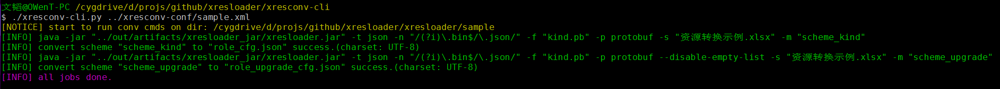
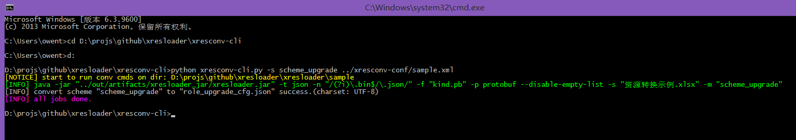

xresconv-cli
==========

这是一个符合 [xresconv-conf](https://github.com/xresloader/xresconv-conf) 规范的CLI转表工具，并且使用 [xresloader](https://github.com/xresloader/xresloader) 作为数据导出工具后端。

依赖python,支持python2.7和python3（不支持python2.6）。

使用说明
------

直接使用仓库内源码或者[下载xresconv-cli](https://github.com/xresloader/xresconv-cli/releases)

```bash
python xresconv-cli.py [本脚本选项]... <转换列表文件> [-- [附加xresloader选项]...]
本脚本选项:
-h, --help                                  帮助信息
-s, --scheme-name <要转换的scheme名称>      按scheme名称指定要转换的表
-v, --version                               显示版本号并退出
-t, --test                                  测试模式（显示运行的脚本，不实际执行）
-p, --parallelism <number>                  转表并发数（并不是并发数越高速度越快，取决于java加载jar时的的编译优化，一般设成2是最快的）
-j, --java-option                           转递给java的参数（可多个）。比如 -j Xmx=2048m
-J, --java-path                             java可执行程序路径
-a, --data-version <version>                数据版本号，将写入到导出的数据文件中。传任意字符串都可以
```

示例截图
------


